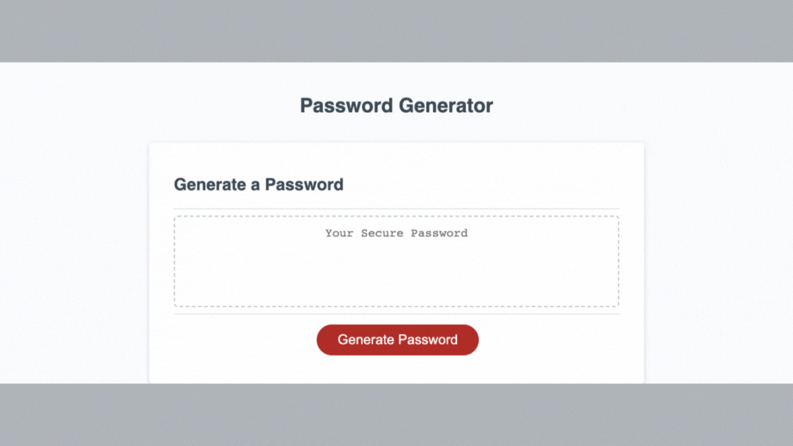

# Password Generator

## Description

This webpage was built to help users generate password that meet certain criteria. The criteria it considers includes password length and the use of characters including uppercase letters, lowercase letters, numerics, and symbols. 

## Installation

N/A

## Usage

This webpage is designed to ask a series of prompts once the generate password button in clicked. Those prompts helps the program to generate a password that meets the users criteria on password length and the use of the various character types mentioned above. Once the prompts are answered the generated password will display in the box with the placeholder 'Your Secure Password'. You can generate as many passwords as you like that meet the criteria for most online accounts. 

## Credits

N/A

## License

Please refer to the license in the repo.

## Deployed Application
[Deployed Application](https://pbullock08.github.io/password-generator/)

